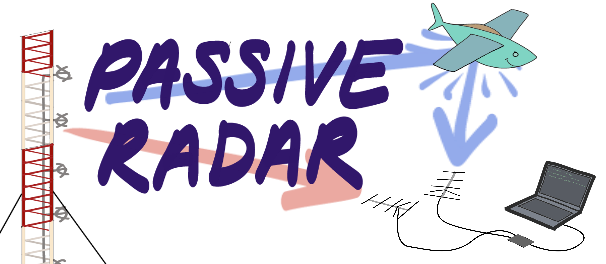

## What Is This???

This repository contains processing code for a software defined radio based passive radar. Passive radars don't transmit any signals of their own - instead, they locate targets by detecting the echoes of ambient radio signals that bounce off of them. Check out [this page](https://dopplerfish.com/passive-radar/) for more information about how passive radar works.

## Usage

First clone the repository and make a conda environment with the required packages (or install them manually).

```
git clone https://github.com/Max-Manning/passiveRadar
cd passiveRadar
conda env create -f environment.yaml
conda activate radar-env
```

You can download some example passive radar data from [here](https://drive.google.com/open?id=18dG__H-nbuHJtG6WCHtPq3c_PRLqJA2O) (note that the file is >6GB). This data was recorded using FM radio broadcast as an illumination source and features signals from some planes flying around. If you want to record your own data, look [here](#recording-your-own-data).

To see how the data is, it is useful to run the following command

```
python signal_preview.py --config PRconfig.yaml
```

Put the data file in the same directory as `main.py`, and run the following command to process the data and save it to a file:

```
python main.py --config prconfig.yaml
```

This will take about 20 minutes. Once it's done running, you can make a video from the recorded data. You will need to have [ffmpeg](https://ffmpeg.org/download.html) installed on your computer in order for the animation to work.

```
python range_doppler_plot.py --config prconfig.yaml --mode video
```

If you don't have ffmpeg, you can just save all the video frames as images:

```
python range_doppler_plot.py --config prconfig.yaml --mode frames
```

You can also use a Kalman filter to track the targets:

```
python multitarget_kalman_tracker.py --config prconfig.yaml --mode video
```

The target tracking functionality is still under development, currently it suffers from a lot of false positives. This could probably be improved by properly tuning the parameters. You can also try the simplified single-target tracker, which has fewer false positives but assumes that only one target is ever present:

```
python simple_kalman_tracker.py --config prconfig.yaml --mode video
```

## Recording Your Own Data

To record passive radar data you will need a software defined radio with at least 2 coherent input channels. By far the cheapest way to do this is to use a pair of RTL-SDR dongles [modified to share a clock](http://kaira.sgo.fi/2013/09/16-dual-channel-coherent-digital.html). Other SDR platforms with multiple receive channels will also work, eg. KerberosSDR, LimeSDR, BladeRF 2.0 Micro, or USRP B210.

If you use RTL-SDR dongles, the gnuradio flow chart shown below is a convenient way to record data.


The program expects the input data to be stored in an hdf5 file, so binary data obtained from the flow chart needs to be converted to hdf5 before it can be used. An easy way to convert binary data files to hdf5 is the `h5import` command-line tool which is included in [the latest hdf5 release](https://www.hdfgroup.org/downloads/hdf5/). See `using_h5import.txt` for brief instructions.

## Contributing

Please submit an issue if you find any bugs, and feel free to submit a pull request if you've made any improvements!
